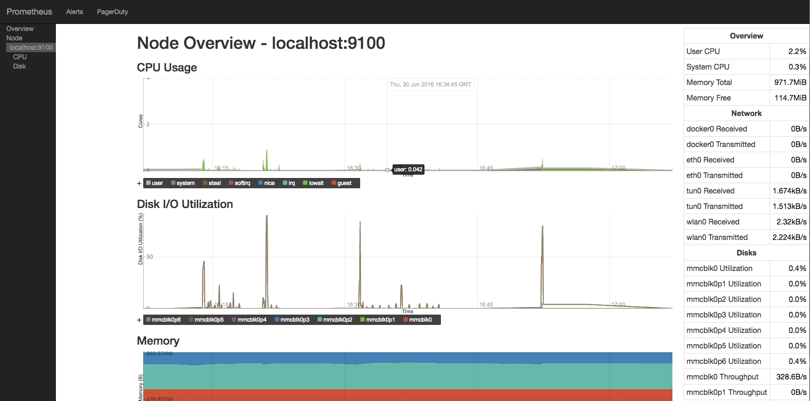

## Section 4 - Surface Critical Server Errors for Diagnosis Using Centralized Logging

Errors and unhealthy states are important to know about, wouldn’t you say? But, too often, server errors are silenced by hasty reboots or simply never having an outlet in the first place. If a server has an error in a forest, but no one is there to hear it, did it actually happen? Why is the server in the forest in the first place? 

UdaPeople chose Prometheus as a monitoring solution since it is open-source and versatile. Once configured properly, Prometheus will turn our server’s errors into sirens that no one can ignore.  

### Setup

Please watch the [video walkthrough of how to set up your EC2 instance and Prometheus here](https://www.youtube.com/watch?v=PSXrbE54FqQ).

- Manually create an EC2 instance and SSH into it.
- Set up Prometheus Server on EC2 following [these instructions](https://codewizardly.com/prometheus-on-aws-ec2-part1/).
- Configure Prometheus for AWS Service Discovery following [these instructions](https://codewizardly.com/prometheus-on-aws-ec2-part3/).

### To Do

#### 1. Setup Back-End Monitoring

In order for server instances to speak to Prometheus, we need to install an “exporter” in each one.  Create a job that uses Ansible to go into the EC2 instance and install the exporter.

- Add a section to your back-end configuration job to install the `node_exporter` for Prometheus monitoring. This should be done using Ansible. Your playbook can simulate the steps in [this tutorial](https://codewizardly.com/prometheus-on-aws-ec2-part2/). 
- After deploy, ensure your back-end is being discovered by the Prometheus Server.
- Provide a screenshot of a graph of your EC2 instance including available memory, available disk space, and CPU usage. **[SCREENSHOT11]**

- Provide a public URL to your Prometheus Server. **[URL35]**

#### 2. Setup Alerts

Now that Prometheus and our EC2 instance have an open line of communication, we need to set up some alerts. The UdaPeople dev team loves their chat tool and wants to receive an alert in chat when the server starts running out of memory or disk space. Set up a job to make that dream a reality.

- SSH into your Prometheus Server.
- Install and configure AlertManager by following [these instructions](https://codewizardly.com/prometheus-on-aws-ec2-part4/).
- You can decide if you will use Slack, email, or another messaging service. Our examples are using Slack, but you should feel free to use the messaging service to which you are most accustomed.
- Set up an alert for low memory or some condition you can control to intentionally cause an alert.
- Provide a screenshot of an alert that was sent by Prometheus. **[SCREENSHOT12]**

sudo useradd --no-create-home prometheus &&
sudo mkdir /etc/prometheus &&
sudo mkdir /var/lib/prometheus &&
wget https://github.com/prometheus/prometheus/releases/download/v2.37.0/prometheus-2.37.0.linux-amd64.tar.gz  &&
tar xvfz prometheus-2.37.0.linux-amd64.tar.gz  &&

sudo cp prometheus-2.37.0.linux-amd64/prometheus /usr/local/bin &&
sudo cp prometheus-2.37.0.linux-amd64/promtool /usr/local/bin/    &&
sudo cp -r prometheus-2.37.0.linux-amd64/consoles /etc/prometheus &&
sudo cp -r prometheus-2.37.0.linux-amd64/console_libraries /etc/prometheus &&

sudo cp prometheus-2.37.0.linux-amd64/promtool /usr/local/bin/  &&
rm -rf prometheus-2.37.0.linux-amd64.tar.gz prometheus-2.37.0.linux-amd64 

sudo chown prometheus:prometheus /etc/prometheus &&
sudo chown prometheus:prometheus /usr/local/bin/prometheus &&
sudo chown prometheus:prometheus /usr/local/bin/promtool &&
sudo chown -R prometheus:prometheus /etc/prometheus/consoles &&
sudo chown -R prometheus:prometheus /etc/prometheus/console_libraries &&
sudo chown -R prometheus:prometheus /var/lib/prometheus &&

sudo systemctl daemon-reload &&
sudo systemctl enable prometheus 

wget https://github.com/prometheus/node_exporter/releases/download/v1.3.1/node_exporter-1.3.1.linux-amd64.tar.gz &&
tar xzf node_exporter-1.3.1.linux-amd64.tar.gz &&
sudo cp node_exporter-1.3.1.linux-amd64/node_exporter /usr/local/bin/node_exporter &&
rm -rf node_exporter-1.3.1.linux-amd64.tar.gz node_exporter-1.3.1.linux-amd64 

sudo systemctl daemon-reload      &&
sudo systemctl enable node-exporter &&
sudo systemctl start node-exporter &&
sudo systemctl status node-exporter 

sudo systemctl daemon-reload &&
sudo systemctl enable prometheus &&
sudo systemctl start prometheus &&
sudo systemctl status prometheus 

[Unit]
Description=Prometheus Node Exporter Service
After=network.target

[Service]
User=node_exporter
Group=node_exporter
Type=simple
ExecStart=/usr/local/bin/node_exporter

[Install]
WantedBy=multi-user.target

global:
  scrape_interval: 15s
  external_labels:
    monitor: 'prometheus'

scrape_configs:
  - job_name: 'prometheus'
    ec2_sd_configs:
      - region: us-east-1
        port: 9100
        filters:
           - name: tag:project
             values: [udapeople]

[Unit]
Description=Prometheus
Wants=network-online.target
After=network-online.target

[Service]
User=prometheus
Group=prometheus
Type=simple
ExecStart=/usr/local/bin/prometheus \
    --config.file /etc/prometheus/prometheus.yml \
    --storage.tsdb.path /var/lib/prometheus/ \
    --web.console.templates=/etc/prometheus/consoles \
    --web.console.libraries=/etc/prometheus/console_libraries

[Install]
WantedBy=multi-user.target

  - job_name: 'promserver'
    static_configs:
      - targets: ['localhost:9090']
  - job_name: 'prometheus'
    ec2_sd_configs:
      - region: us-east-1
        port: 9100
        filters:
           - name: tag:project
             values: [udapeople]
    relabel_configs:
      - source_labels: [__meta_ec2_tag_Project, __meta_ec2_tag_Name]
        separator: "_"
        target_label: instance
      - source_labels: [__meta_ec2_instance_id]
        target_label: instance_id
      - source_labels: [__meta_ec2_public_dns_name]
        target_label: public_dns_name

        wget https://github.com/prometheus/alertmanager/releases/download/v0.21.0/alertmanager-0.21.0.linux-amd64.tar.gz &&
tar xvfz alertmanager-0.21.0.linux-amd64.tar.gz  &&

sudo cp alertmanager-0.21.0.linux-amd64/alertmanager /usr/local/bin &&
sudo cp alertmanager-0.21.0.linux-amd64/amtool /usr/local/bin/ &&
sudo mkdir /var/lib/alertmanager &&

rm -rf alertmanager*

        /etc/prometheus/alertmanager.yml.
route:
  group_by: [Alertname]
  receiver: email-me

receivers:
- name: email-me
  email_configs:
  - to: EMAIL_YO_WANT_TO_SEND_EMAILS_TO
    from: YOUR_EMAIL_ADDRESS
    smarthost: smtp.gmail.com:587
    auth_username: YOUR_EMAIL_ADDRESS
    auth_identity: YOUR_EMAIL_ADDRESS
    auth_password: YOUR_EMAIL_PASSWORD

/etc/systemd/system/alertmanager.service
[Unit]
Description=Alert Manager
Wants=network-online.target
After=network-online.target

[Service]
Type=simple
User=prometheus
Group=prometheus
ExecStart=/usr/local/bin/alertmanager \
  --config.file=/etc/prometheus/alertmanager.yml \
  --storage.path=/var/lib/alertmanager

Restart=always

[Install]
WantedBy=multi-user.target

hpkcfbqispbovgfz

sudo systemctl daemon-reload &&
sudo systemctl enable alertmanager   &&
sudo systemctl start alertmanager

/etc/prometheus/rules.yml

groups:
- name: Down
  rules:
  - alert: InstanceDown
    expr: up == 0
    for: 3m
    labels:
      severity: 'critical'
    annotations:
      summary: "Instance  is down"
      description: " of job  has been down for more than 3 minutes."